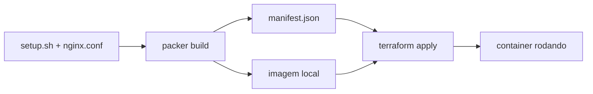

# Capstone Lab 3 — empacotar como portfólio

**~1h · o entregável**

## Objetivo
Transformar os labs num repositório público que sustenta a conversa de arquiteto.

## Checklist
- [ ] `README.md` com: o que é, por que existe, como rodar em 3 comandos
- [ ] Diagrama mermaid do fluxo (Packer → manifest → Terraform → container)
- [ ] `build.ps1` rodando a cadeia inteira: `packer init/validate/build` → `terraform init/plan/apply`
- [ ] `destroy.ps1` que limpa tudo, inclusive as imagens geradas
- [ ] `.terraform.lock.hcl` **versionado**
- [ ] Versões pinadas: provider, plugin do Packer, `required_version` do Terraform
- [ ] Seção "próximos passos: AWS" mostrando o que mudaria (use a tabela do Bloco 4 do HTML)

## Diagrama sugerido

## O critério real
Um estranho clona o repo, roda `./build.ps1` e tem a coisa funcionando
**sem te perguntar nada**. Se precisar de você para explicar, o README não está pronto.

## Por que isto vale
O `plano-certificacoes-completo.html` chama isto de capstone e diz que
"vale tanto quanto uma cert numa entrevista de arquiteto". Esta é a versão local —
entregável agora, e que depois só cresce trocando Docker por AWS.

## Notas
