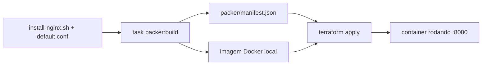

# Capstone Lab 3 — empacotar como portfólio

**~1h · o entregável**

## Objetivo
Fazer o pipeline do Lab 12 (`capstone-ponte`) rodar com **um comando**, e
deixar documentado o bastante pra um estranho clonar o repo e reproduzir sem
te perguntar nada.

> Diferente do README original: este repo **já é** o repositório de
> portfólio (está no GitHub, é o shape de produção desde o início). Não
> existe "copiar pra uma pasta `capstone/` separada" — o entregável é
> deixar o pipeline do Lab 12 fácil de rodar e fácil de explicar, dentro
> do repo que já existe.

## Onde o código mora

Duas tasks novas em `Taskfile.yml`, na raiz — não scripts soltos. O repo
inteiro já funciona assim (`task packer:build`, `task tf:apply`, etc.); o
capstone não deveria ser a exceção que quebra "todo comando entra por
`task`".

## Tasks a criar

`capstone:build` — builda a imagem e sobe o container, os dois comandos do
Lab 12 em sequência:

```yaml
capstone:build:
  desc: "Roda o pipeline completo do capstone: Packer builda, Terraform sobe"
  cmds:
    - task: packer:build
      vars: { IMAGE: capstone-nginx }
    - terraform -chdir=terraform/stacks/capstone-ponte init
    - terraform -chdir=terraform/stacks/capstone-ponte apply -auto-approve
```

`capstone:destroy` — desfaz e limpa:

```yaml
capstone:destroy:
  desc: "Destrói o container do capstone (a limpeza de imagem já existe: task clean)"
  cmds:
    - terraform -chdir=terraform/stacks/capstone-ponte destroy -auto-approve
```

Repare que **não precisa reinventar** a limpeza de imagem: o template
`capstone-nginx.pkr.hcl` não tem `post-processor "docker-tag"` (só
`commit = true`), então a imagem gerada fica sem tag — exatamente o que
`task clean` (`docker image prune -f`) já remove. Rode `task clean` depois
de `capstone:destroy` se quiser limpar a imagem também, em vez de duplicar
lógica de filtro por nome de imagem que nem existe aqui.

> Confira a sintaxe (`cmds:`, `dir:`, `preconditions:`) contra as tasks que
> já existem no arquivo — copie o estilo que já está lá, não invente um
> novo. E lembre: `cmds` é interpretado por shell POSIX (`mvdan/sh`), não
> PowerShell, mesmo no Windows — nada de `Get-ChildItem`/`ForEach-Object`
> direto num `cmds:` (é o comentário que já existe em `packer:validate`).

## Checklist do conteúdo

- [ ] `task capstone:build` roda a cadeia inteira (Packer + Terraform) com
      um comando só
- [ ] `task capstone:destroy` destrói o container; `task clean` (já existe)
      limpa a imagem sem tag gerada pelo build
- [ ] Diagrama mermaid do fluxo no README do Lab 12 (Packer → manifest →
      Terraform → container) — ou aqui, referenciando o Lab 12
- [ ] `.terraform.lock.hcl` **versionado**: confira
      `git check-ignore -v terraform/stacks/capstone-ponte/.terraform.lock.hcl`
      — não deve retornar nada (se retornar, o arquivo está sendo ignorado
      por engano)
- [ ] Versões pinadas: `required_providers` do stack, plugin do Packer
      (`~> 1`), `required_version` do Terraform — todos já deveriam estar
      certos desde o Lab 12, só confirme
- [ ] Seção "próximos passos: multi-cloud" no README do Lab 12 ou aqui,
      linkando pra [`docs/PROXIMO-TRACK.md`](../PROXIMO-TRACK.md) em vez da
      tabela antiga de tradução pra AWS — o próximo track já cobre isso em
      mais detalhe (AWS + Azure + OCI, não só AWS)

## Diagrama sugerido



## Rodar

Da raiz `labs/`:

```powershell
task capstone:build
curl http://localhost:8080
task capstone:destroy
task clean
```

## O critério real
Um estranho clona o repo, roda `task capstone:build` e tem a coisa
funcionando **sem te perguntar nada**. Se precisar de você para explicar, o
README do Lab 12 não está pronto. Peça pra alguém (ou releia você mesmo em
outro dia, "a frio") seguir só o README.

## Publicar

```powershell
git add -A
git commit -m "Capstone: task capstone:build/destroy para o pipeline Packer -> Terraform"
git push
```

## Por que isto vale
Isso é o argumento concreto de portfólio: não é "eu sei Terraform", é "eu
projetei um framework que qualquer pessoa do time roda com um comando" —
literalmente o que a vaga-alvo pede ("plataformas de automação
self-service... frameworks reutilizáveis de infraestrutura como código").

## Notas

- **`task capstone:build` rodou do zero e funcionou de primeira** — o Packer
  buildou a imagem (usando `packer/scripts/install-nginx.sh` e
  `packer/files/capstone/default.conf`, ambos reaproveitados de labs
  anteriores), o Terraform inicializou e aplicou, e `curl http://localhost:8080`
  confirmou `capstone v2` — sem precisar de nenhum comando extra fora da task.
- **`task capstone:destroy` + `task clean` limparam tudo de verdade**,
  confirmado com `docker ps -a` (container removido). O `task clean` liberou
  2.2GB de imagens sem tag acumuladas ao longo da sessão inteira, não só do
  capstone — é uma limpeza geral do Docker local, não escopada por lab.
- **Achado ao validar a sintaxe do Taskfile antes de entregar:** o
  `Add-Content` do PowerShell sem `-Encoding UTF8` teria corrompido o "ó" de
  "Destrói" na descrição da task — mesma classe de bug do `Set-Content` já
  documentada nos Labs 07 e no script de autostart do Docker. Pego a tempo,
  confirmado o encoding certo em `task --list` antes de rodar.
- **`task: <outra-task>` com `vars:` (uma task chamando outra) não tinha
  precedente no `Taskfile.yml`** — validei a sintaxe com `task --dry` num
  scratch antes de sugerir, pra não entregar algo hipotético.
