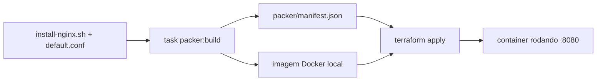

# Capstone Lab 3 — empacotar como portfólio

**~1h · o entregável**

## Objetivo
Fazer o pipeline do Lab 12 (`capstone-ponte`) rodar com **um comando**, e
deixar documentado o bastante pra um estranho clonar o repo e reproduzir sem
te perguntar nada.

## Teoria

**O que "empacotar" significa aqui.** O pipeline do Lab 12 funciona — mas
funciona porque *você* lembra a sequência: buildar com o `IMAGE=` certo,
depois `init`, depois `apply`, no diretório certo. Isso não é um produto; é
conhecimento na sua cabeça.

Empacotar é transformar essa sequência em **uma coisa que qualquer pessoa
executa**, sem te perguntar nada. É a diferença entre "eu sei fazer" e "eu
construí algo que funciona sem mim".

**Por que ponto de entrada único importa.** Um repo de IaC acumula comandos:
`packer build` com flags, `terraform -chdir` com caminhos, scripts de
limpeza. Sem uma camada de verbos, esse conhecimento vive em README solto,
histórico de shell e memória — e some quando a pessoa sai do time.

O `Taskfile.yml` é essa camada neste repo: **todo comando entra por `task`**.
A vantagem não é digitar menos, é que `task --list` responde "o que dá pra
fazer aqui?" sem ninguém precisar explicar.

**A regra que este lab respeita:** primeiro fazer na mão, depois automatizar.
Você já rodou esses comandos separados no Lab 12 e entendeu cada um. Só agora
faz sentido escondê-los atrás de um verbo — automatizar antes de entender é
como criar uma caixa-preta pra si mesmo.

**Reaproveitar em vez de reinventar.** O repo já tem `task clean`
(`docker image prune -f`). O `capstone:destroy` não precisa de lógica própria
de limpeza de imagem — e tentar filtrar por nome seria pior, porque a imagem
do capstone nem tem tag (o template usa só `commit = true`, sem
`docker-tag`). Saber o que **não** escrever é parte do trabalho.

**Atenção ao shell.** O `cmds:` do Taskfile é interpretado por
**shell POSIX** (`mvdan/sh`), não PowerShell — mesmo no Windows. Escrever
`Get-ChildItem` ou `ForEach-Object` ali dentro parece funcionar (o YAML
aceita), mas quebra na hora de rodar. É o comentário que já existe no
`packer:validate`.

## O que vamos criar

Duas tasks novas em `Taskfile.yml`, na raiz — não scripts soltos. O repo
inteiro já funciona assim (`task packer:build`, `task status`, `task clean`);
o capstone não deveria ser a exceção que quebra "todo comando entra por
`task`".

> Diferente do README original deste lab: este repo **já é** o repositório de
> portfólio (está no GitHub, é o shape de produção desde o início). Não
> existe "copiar pra uma pasta `capstone/` separada" — o entregável é deixar
> o pipeline do Lab 12 fácil de rodar e fácil de explicar, dentro do repo que
> já existe.

## Passo 1 — adicionar as tasks ao Taskfile

Este lab **acrescenta** a um arquivo existente em vez de criar um novo — por
isso o script usa append, não overwrite (senão você perderia todas as outras
tasks).

Rode da raiz `labs/`:

```powershell
# Acrescenta ao final do Taskfile.yml preservando LF (o padrão do repo para
# *.yml, ver .gitattributes). Note que é append: sobrescrever apagaria as
# tasks que já existem.
$novasTasks = @'

  capstone:build:
    desc: "Roda o pipeline completo do capstone: Packer builda, Terraform sobe"
    cmds:
      - task: packer:build
        vars: { IMAGE: capstone-nginx }
      - terraform -chdir=terraform/stacks/capstone-ponte init
      - terraform -chdir=terraform/stacks/capstone-ponte apply -auto-approve

  capstone:destroy:
    desc: "Destrói o container do capstone (a limpeza de imagem já existe: task clean)"
    cmds:
      - terraform -chdir=terraform/stacks/capstone-ponte destroy -auto-approve
'@ -replace "`r`n", "`n"

$atual = [System.IO.File]::ReadAllText("$PWD/Taskfile.yml", [System.Text.Encoding]::UTF8) -replace "`r`n", "`n"
[System.IO.File]::WriteAllText("$PWD/Taskfile.yml", $atual.TrimEnd() + "`n" + $novasTasks + "`n", (New-Object System.Text.UTF8Encoding $false))
```

Confirme que as duas apareceram, com os acentos corretos:

```powershell
task --list
```

Se `Destrói` aparecer como `Destrói`, o encoding saiu errado — refaça o
passo (foi o motivo de o script acima usar `WriteAllText` com UTF-8 explícito
em vez de `Add-Content`).

## Passo 2 — rodar

```powershell
task capstone:build
curl http://localhost:8080
task capstone:destroy
task clean
```

Um comando builda a imagem **e** sobe o container. Outro desfaz. É o
entregável do lab.

## Checklist do conteúdo

- [ ] `task capstone:build` roda a cadeia inteira (Packer + Terraform) com
      um comando só
- [ ] `task capstone:destroy` destrói o container; `task clean` (já existe)
      limpa a imagem sem tag gerada pelo build
- [ ] Diagrama mermaid do fluxo no README do Lab 12 (Packer → manifest →
      Terraform → container) — ou aqui, referenciando o Lab 12
- [ ] `.terraform.lock.hcl` **versionado**: confira
      `git check-ignore -v terraform/stacks/capstone-ponte/.terraform.lock.hcl`
      — não deve retornar nada (se retornar, o arquivo está sendo ignorado
      por engano)
- [ ] Versões pinadas: `required_providers` do stack, plugin do Packer
      (`~> 1`), `required_version` do Terraform — todos já deveriam estar
      certos desde o Lab 12, só confirme
- [ ] Seção "próximos passos: multi-cloud" no README do Lab 12 ou aqui,
      linkando pra [`docs/PROXIMO-TRACK.md`](../../PROXIMO-TRACK.md) em vez da
      tabela antiga de tradução pra AWS — o próximo track já cobre isso em
      mais detalhe (AWS + Azure + OCI, não só AWS)

## Diagrama sugerido



## Critério de conclusão
`task capstone:build` sobe o pipeline inteiro com um comando, `curl` responde,
e `task capstone:destroy` + `task clean` desfazem tudo.

> **O teste final — "um estranho clona o repo e faz funcionar sem te perguntar
> nada" — fica pro curso completo**, não pra este lab isolado. Faz mais
> sentido validar o treinamento inteiro de uma vez, com revisores externos, do
> que lab por lab. Está planejado como Fase 6 em `labs-html/PLANO-CURSO.md`
> (fora deste repositório).

## Limpeza

As próprias tasks que você acabou de criar são a limpeza — é justamente o
ponto do lab:

```powershell
task capstone:destroy
task clean
```

## Publicar

```powershell
git add -A
git commit -m "Capstone: task capstone:build/destroy para o pipeline Packer -> Terraform"
git push
```

## Por que isto vale
Isso é o argumento concreto de portfólio: não é "eu sei Terraform", é "eu
projetei um framework que qualquer pessoa do time roda com um comando" —
literalmente o que a vaga-alvo pede ("plataformas de automação
self-service... frameworks reutilizáveis de infraestrutura como código").

## Notas

- **`task capstone:build` rodou do zero e funcionou de primeira** — o Packer
  buildou a imagem (usando `packer/scripts/install-nginx.sh` e
  `packer/files/capstone/default.conf`, ambos reaproveitados de labs
  anteriores), o Terraform inicializou e aplicou, e `curl http://localhost:8080`
  confirmou `capstone v2` — sem precisar de nenhum comando extra fora da task.
- **`task capstone:destroy` + `task clean` limparam tudo de verdade**,
  confirmado com `docker ps -a` (container removido). O `task clean` liberou
  2.2GB de imagens sem tag acumuladas ao longo da sessão inteira, não só do
  capstone — é uma limpeza geral do Docker local, não escopada por lab.
- **Achado ao validar a sintaxe do Taskfile antes de entregar:** o
  `Add-Content` do PowerShell sem `-Encoding UTF8` teria corrompido o "ó" de
  "Destrói" na descrição da task — mesma classe de bug do `Set-Content` já
  documentada nos Labs 07 e no script de autostart do Docker. Pego a tempo,
  confirmado o encoding certo em `task --list` antes de rodar.
- **`task: <outra-task>` com `vars:` (uma task chamando outra) não tinha
  precedente no `Taskfile.yml`** — validei a sintaxe com `task --dry` num
  scratch antes de sugerir, pra não entregar algo hipotético.
