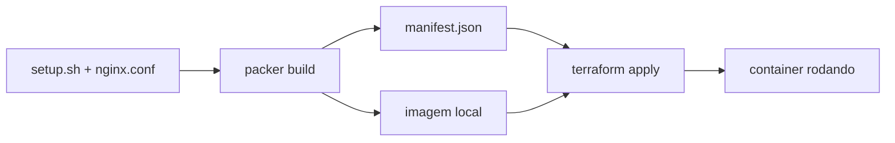

# Capstone Lab 3 — empacotar como portfólio

> **⚠ Conteúdo pendente de migração de estrutura.**
> Este README ainda descreve o layout antigo (uma pasta por lab, com
> `cd` e arquivos soltos). O repo agora usa shape de produção: o código
> deste lab vai morar em `raiz (Taskfile.yml, CI)`, e os comandos entram por
> `task` a partir da raiz — sem `cd`. O conteúdo conceitual (HCL, o que
> cada bloco faz, o "Quebre isto") segue válido; os **caminhos e comandos**
> serão ajustados quando chegarmos neste lab. Ver [README raiz](../../../README.md).

**~1h · o entregável**

## Objetivo
Transformar os labs num repositório público que sustenta a conversa de arquiteto.
Use o conteúdo de `12-capstone-ponte` como base do que vai virar o repo final
(ou uma pasta nova `capstone/` copiando o que já funcionou).

## Scripts a criar

`build.ps1`:
```powershell
#!/usr/bin/env pwsh
$ErrorActionPreference = "Stop"

Write-Host "==> packer init" -ForegroundColor Cyan
packer init .

Write-Host "==> packer validate" -ForegroundColor Cyan
packer validate .

Write-Host "==> packer build" -ForegroundColor Cyan
packer build .

Write-Host "==> terraform init" -ForegroundColor Cyan
Push-Location terraform
terraform init

Write-Host "==> terraform plan" -ForegroundColor Cyan
terraform plan -out=tfplan

Write-Host "==> terraform apply" -ForegroundColor Cyan
terraform apply -auto-approve tfplan
Pop-Location

Write-Host "==> pronto: http://localhost:8080" -ForegroundColor Green
```

`destroy.ps1`:
```powershell
#!/usr/bin/env pwsh
$ErrorActionPreference = "Stop"

Push-Location terraform
terraform destroy -auto-approve
Pop-Location

Write-Host "==> removendo imagens locais geradas" -ForegroundColor Cyan
docker images --filter "reference=meuapp*" -q | ForEach-Object { docker rmi -f $_ }
Remove-Item -ErrorAction SilentlyContinue manifest.json, terraform\tfplan
```

## Checklist do conteúdo
- [ ] `README.md` com: o que é, por que existe, como rodar em 3 comandos
- [ ] Diagrama mermaid do fluxo (Packer → manifest → Terraform → container)
- [ ] `build.ps1` rodando a cadeia inteira
- [ ] `destroy.ps1` limpando tudo, inclusive as imagens geradas
- [ ] `.terraform.lock.hcl` **versionado** (confira: `git check-ignore -v terraform/.terraform.lock.hcl` não deve retornar nada)
- [ ] Versões pinadas: `required_providers`, plugin do Packer (`~> 1`), `required_version` do Terraform
- [ ] Seção "próximos passos: AWS" com a tabela de tradução do Bloco 4 do HTML

## Diagrama sugerido


## Rodar
```powershell
.\build.ps1
curl http://localhost:8080
.\destroy.ps1
```

## O critério real
Um estranho clona o repo, roda `.\build.ps1` e tem a coisa funcionando
**sem te perguntar nada**. Se precisar de você para explicar, o README não está pronto.
Peça pra alguém (ou releia você mesmo em outro dia, "a frio") seguir só o README.

## Publicar
```powershell
git add -A
git commit -m "Capstone: pipeline Packer -> Terraform completo, local-first"
git push
```

## Por que isto vale
O `plano-certificacoes-completo.html` chama isto de capstone e diz que
"vale tanto quanto uma cert numa entrevista de arquiteto". Esta é a versão
local — entregável agora, e que depois só cresce trocando Docker por AWS.

## Notas
